# Inbound Email Pipeline Diagrams

Date: 2026-05-23

This document visualizes two states:

1. The current inbound email pipeline implemented in Paperclip.
2. The proposed full autonomous support pipeline described in
   `doc/plans/2026-05-23-full-autonomous-support-implementation.md`.

The important product boundary is that email intake is not a separate execution
system. It feeds Paperclip-native objects: messages, issues, comments, agents,
workspaces, approvals, deploy events, infra incidents, work products, and
activity logs.

## Current Pipeline: Worker and Queue

The current system is a two-stage email worker backed by the existing
`background_jobs` table. Polling imports raw messages and attachments; processing
later classifies and routes them.

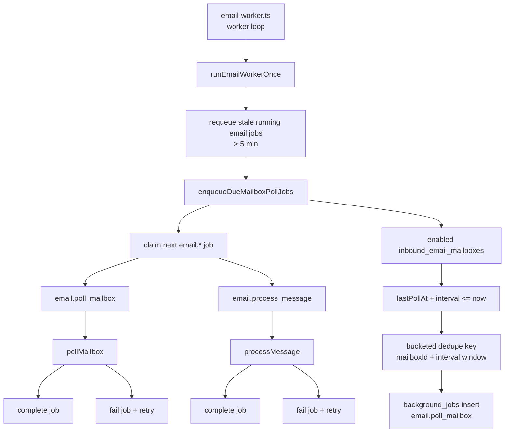

## Current Pipeline: Mailbox Poll and Import

Polling opens the mailbox, fetches unread messages, persists raw evidence, stores
attachments, and queues message processing. Source mailbox cleanup happens only
after a terminal outcome.

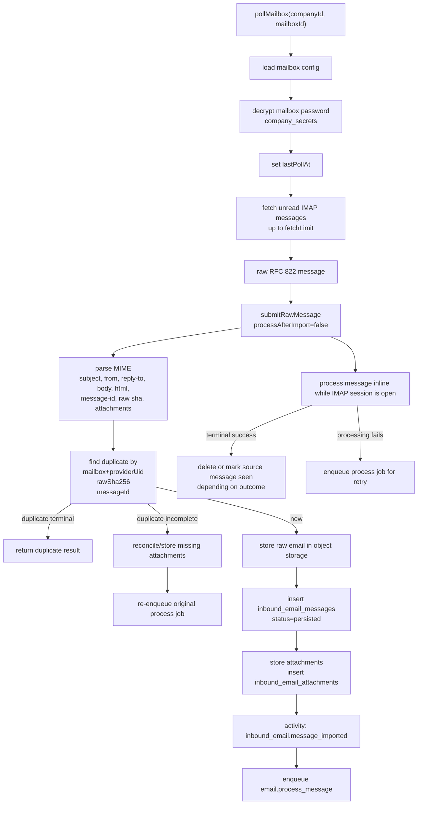

## Current Pipeline: Processing, Classification, and Routing

The current support foundation classifies recognized support messages
deterministically, applies policy gates, creates issues/incidents where allowed,
sends configured replies, and quarantines unsafe/spam input.

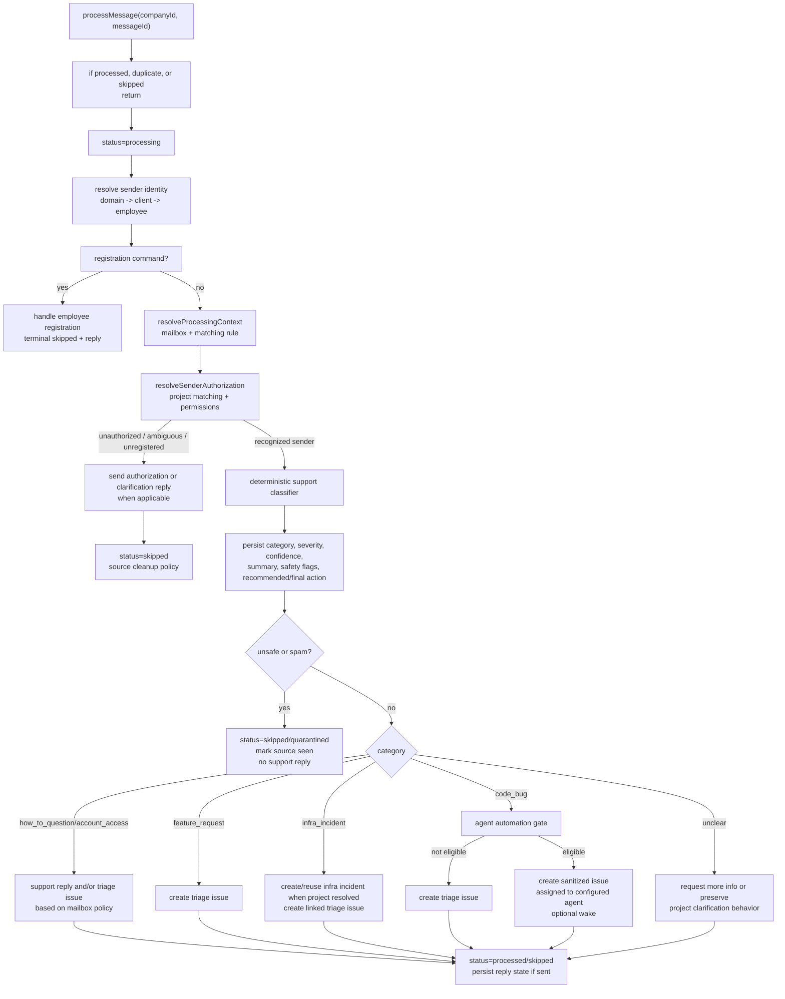

## Current Pipeline: Code-Bug Agent Automation Gate

Code-bug automation already uses Paperclip's existing issue and agent structure.
The email does not directly execute code; it creates a sanitized issue and can
optionally wake an existing agent.

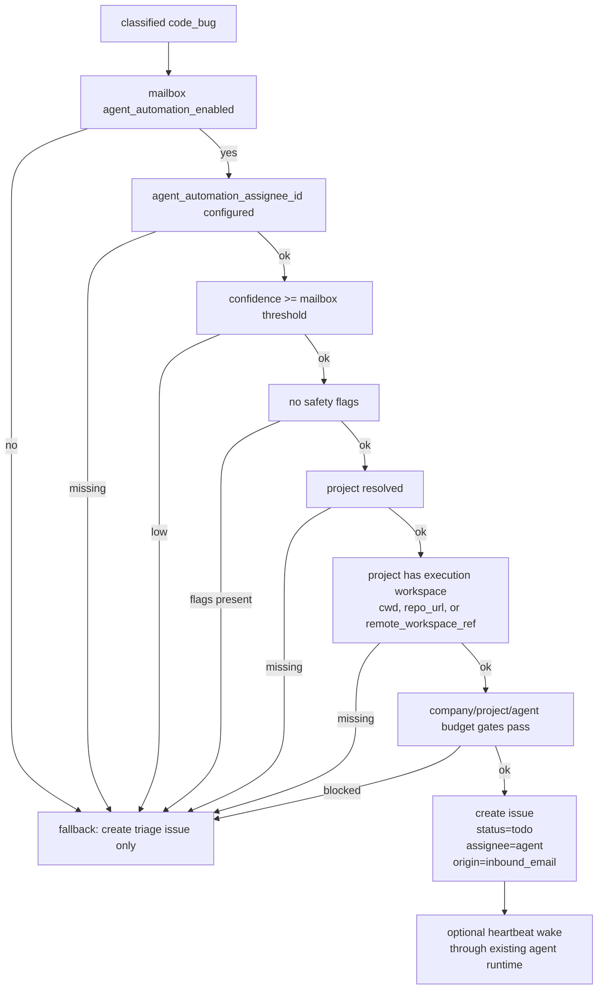

## Current Pipeline: Deploy and Infra Foundations

Deployment and infrastructure support exist as approval-gated foundations. They
record evidence and can execute configured deploy/rollback commands only when a
deployment target opts in. Provider repair, DNS mutation, failover, and VPS
mutation are still intentionally out of scope.

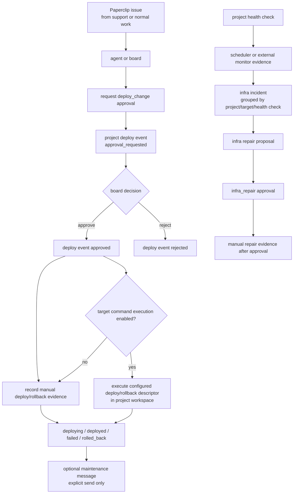

## Current Data Links

The current implementation already connects email support intake to core
Paperclip records.

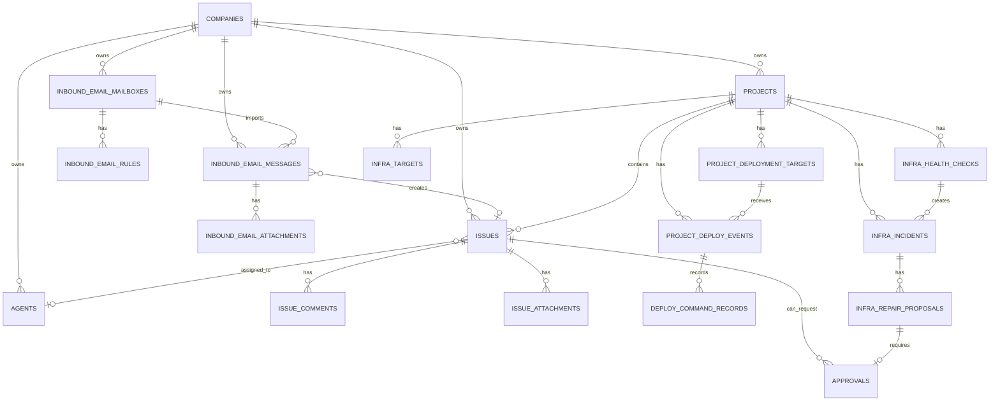

## Final Pipeline: Full Autonomous Support Loop

The final proposal adds a support-case layer, optional LLM classification,
centralized policy, richer agent outcomes, approval-gated deploy/repair, and
customer communication automation. Execution still runs through existing
Paperclip agents and governed work objects.

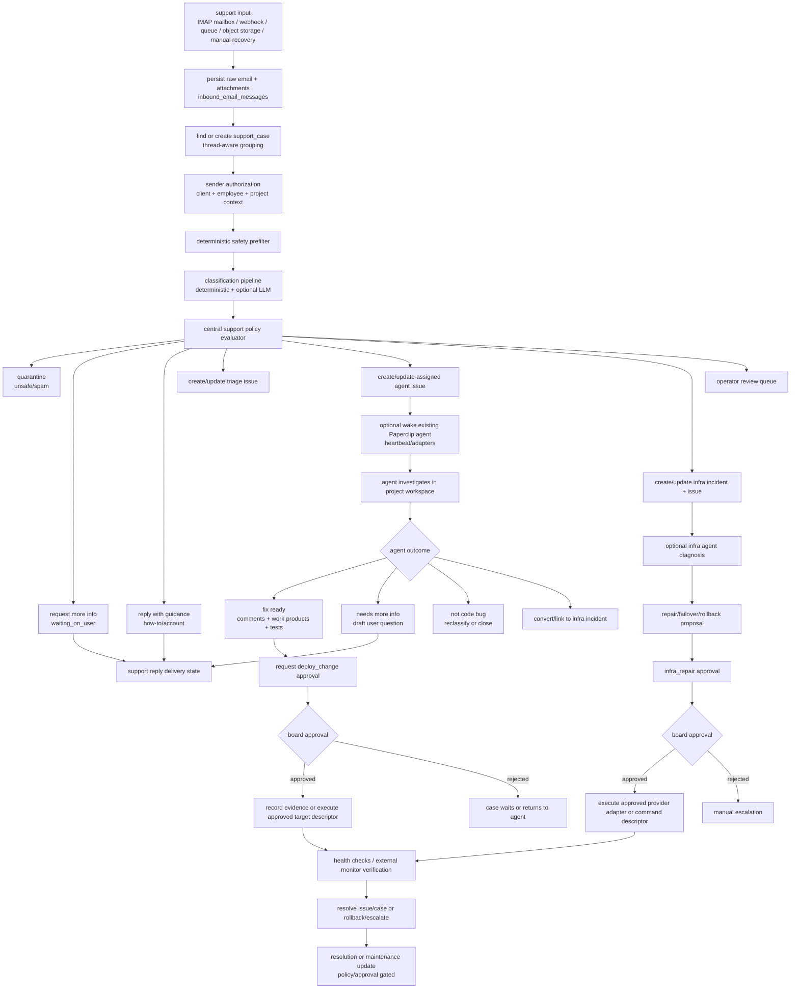

## Final Pipeline: Classification and Policy Detail

This is the key safety boundary. The LLM may improve understanding, but policy
still decides what happens.

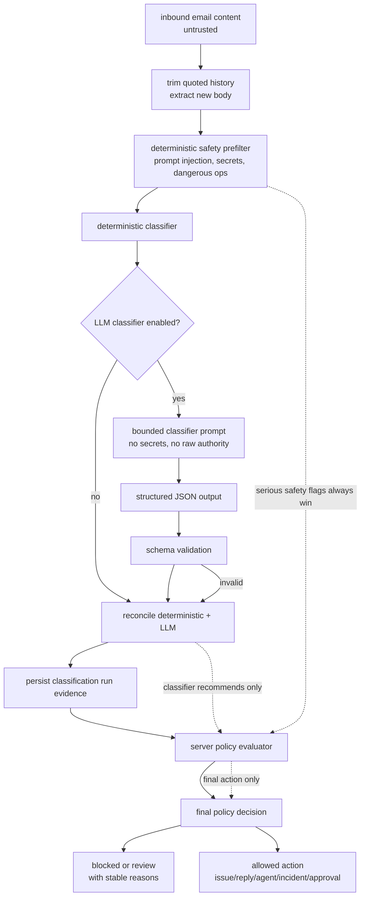

## Final Pipeline: Code Bug From Email to Deploy

The full code-bug loop uses existing Paperclip issue execution. The only new
support-specific layer is support case tracking and policy.

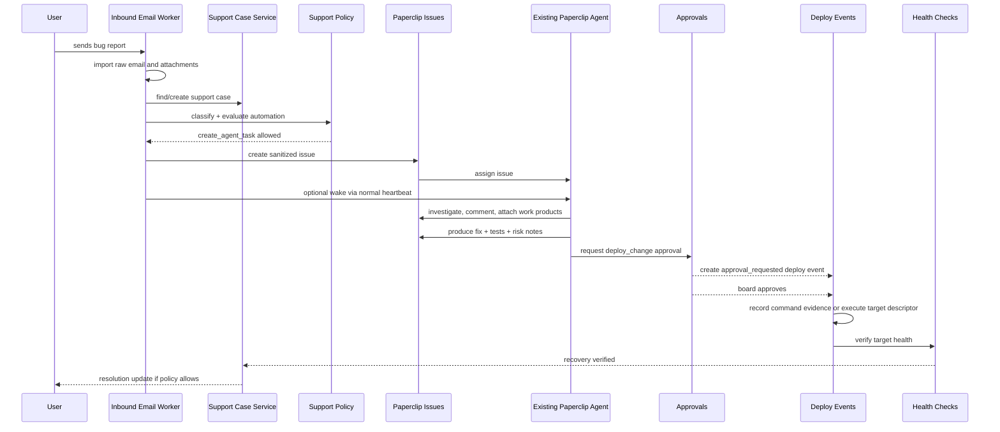

## Final Pipeline: Infrastructure Incident and Repair

Infra automation remains more constrained than code automation. User email or
health checks can create evidence and incidents, but repair/failover needs
approval and provider-specific execution paths.

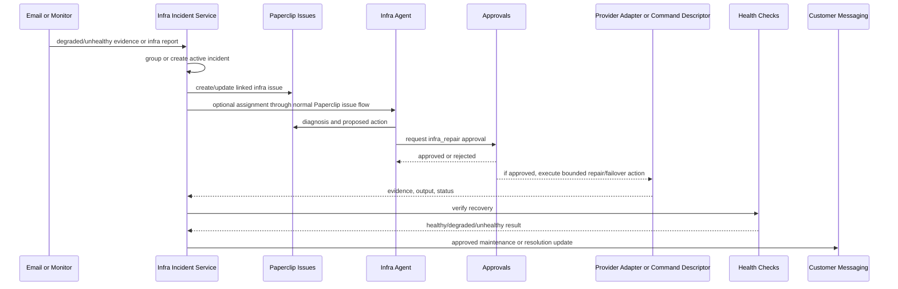

## Final Data Model Additions

The proposed system adds support cases and classification run evidence while
continuing to use existing Paperclip records for actual work and execution.

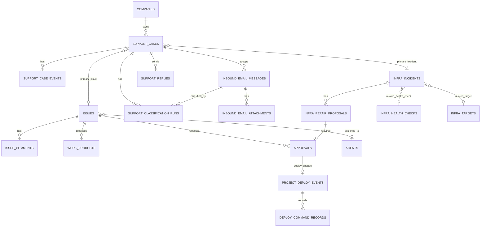

## Final State Machine: Support Case Lifecycle

Support cases become the durable support-thread object that keeps email,
issues, incidents, replies, approvals, deploys, and agent work together.

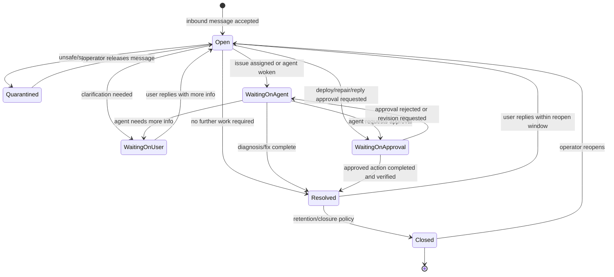

## Final Authorization and Safety Boundaries

This diagram shows the hard boundaries that should remain true even after LLMs,
agents, deploy automation, and infra repair are added.

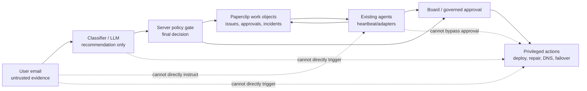

## Recommended Next Diagrams to Keep Updated

When implementation begins, keep these diagrams current:

1. Support case entity links.
2. Classification and policy decision flow.
3. Code-bug agent workflow.
4. Infra incident and repair workflow.
5. Deploy approval and command evidence workflow.
6. Support reply and maintenance-message workflow.

